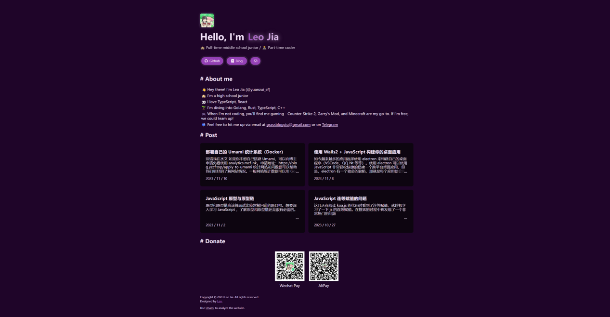

# 🖥️ Lite Page
A lite personal page template.

[Demo](https://yzcf.top)

---

## Use

> [!IMPORTANT]
> After folk or clone the repo, remember to remove redundant code like analytic code which used to analyze my own site. It doesn't work on your site!

Just fork the repo, edit the template and deploy your site on vercel automatically!

If you do not want to deploy the page on vercel, you need to clone the repo to your computer, and install the dependencies by `npm` or `yarn` (Need Nodejs). After that, run `yarn build` or `npm run build` to build your static page. The static files will be output in `dist` folder. Then put them into anywhere you want to deploy your site on.

## Setting

### Blog Posts

You can simply go to `index.ts`, change the url in `getPosts()`. Most time the function will work. However, there are some other XML format different from what I have tested. So you may change the function in `page.ts`  yourself. If you are not familiar with TypeScript or JavaScript, you can start an [issue](https://github.com/yuanzui-cf/lite-page/issues/new). I will help you after noticing your issue.  

### Others

> WIP
